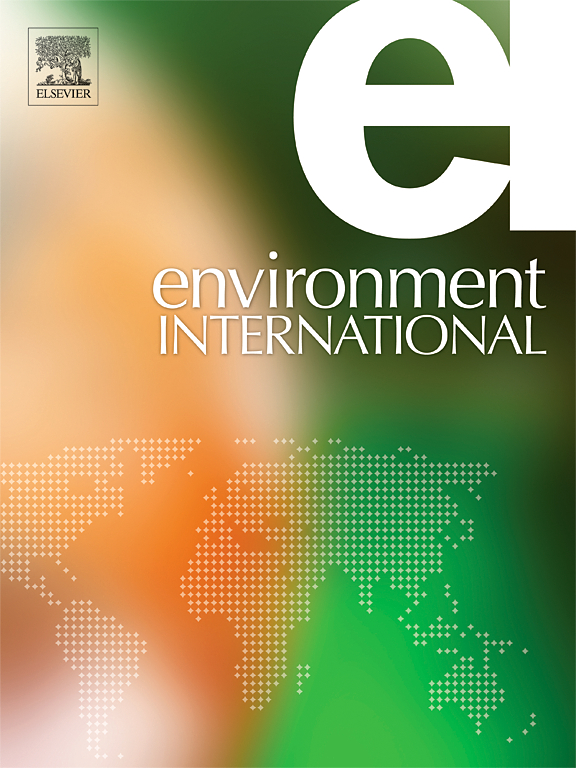
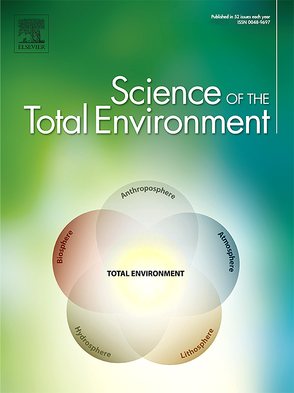
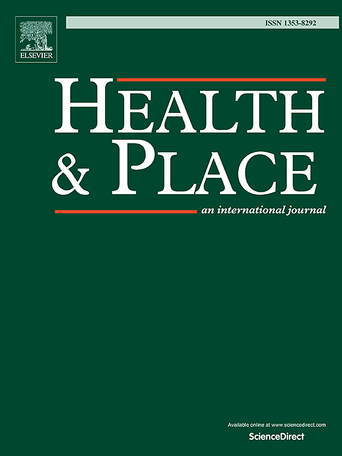
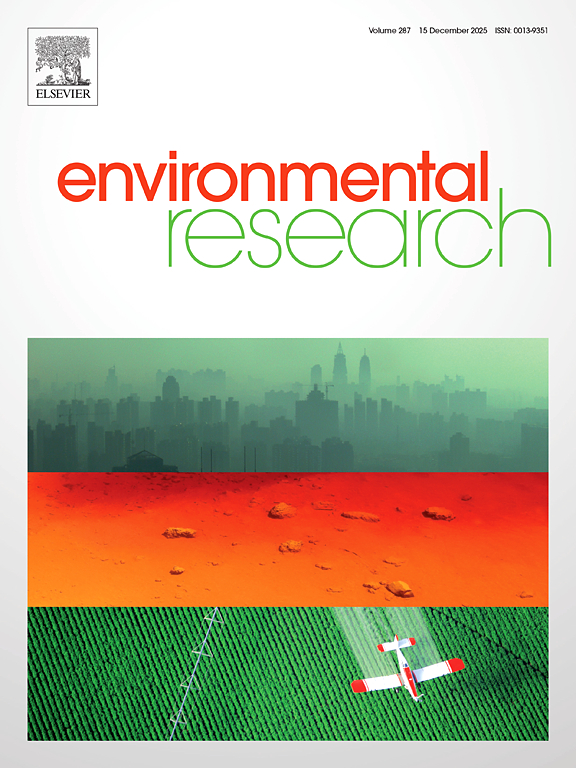
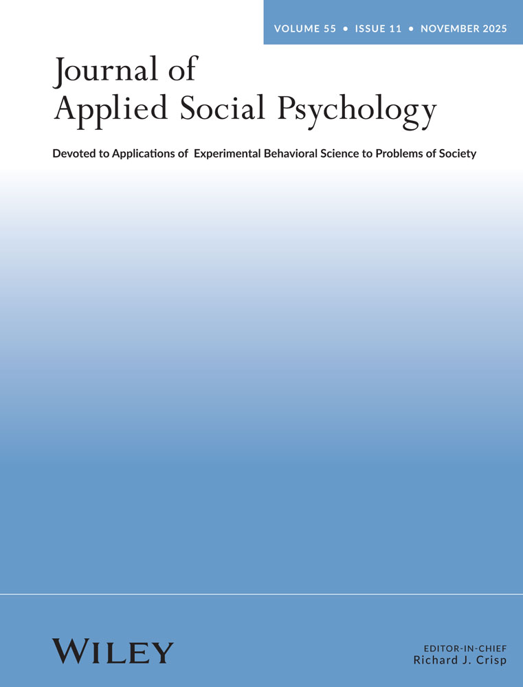
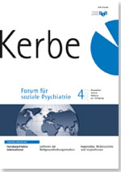
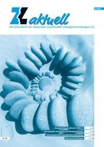

::::: {.profile-container}

:::: {.profile-image}
{fig-alt="Niklas Hlubek"}

::: {.profile-contact}
[n.hlubek@umcutrecht.nl](mailto:n.hlubek@umcutrecht.nl) 
[Curriculum Vitae](files/cv.pdf) 
[Google Scholar](https://scholar.google.com/citations?user=Lkd3H1kAAAAJ) 
[GitHub](https://github.com/nhlubek) 
[LinkedIn](https://www.linkedin.com/in/niklas-hlubek/)
:::
::::

:::: {.profile-content}

<h2 class="main-title">Niklas Hlubek</h2>

I am a health data scientist working with large-scale real-world health data.

I work in the [Real-World Evidence group](https://research.umcutrecht.nl/research-groups/real-world-evidence-group/) at UMC Utrecht on studies of medicines and vaccines, using health care databases from across Europe. I write software to check and analyse these data, and apply causal inference methods in studies that inform regulatory decisions.

I did my PhD in Epidemiology at Utrecht University as a Marie Skłodowska-Curie fellow in the EU [SURREAL](https://surreal-itn.eu/) network, using Dutch registry data on more than 12 million people to study socioeconomic inequalities in health.

Before that, I worked in clinical psychology research and European mental health policy.

::: {.focus}
Real-world data · Pharmacoepidemiology · Causal inference · Data quality · Reproducible R
:::

**Publications**

:::: {.paper}
[{fig-alt=""}](https://doi.org/10.1016/j.envint.2026.110351){.paper-cover}

::: {.paper-body}
[Air pollution and mortality across socioeconomic groups in the Netherlands](https://doi.org/10.1016/j.envint.2026.110351){.paper-title} 
**Hlubek N.**, Vienneau D., Wagtendonk A., van den Brekel L., Vaartjes I., Koop Y. 
*Environment International*, 2026

Abstract

**Background**: \
We investigated whether associations between long-term air pollution and (cause-specific) mortality outcomes differ across socioeconomic position (SEP) groups in the Netherlands. \

**Methods**: \
This nationwide cohort study included 9.9 million adults aged ≥30 years in the Netherlands, followed from 2014 to 2019. We linked annual average residential exposure to particulate matter (PM2.5, PM10) and nitrogen dioxide (NO2) with household- and neighbourhood-level socioeconomic indicators (financial welfare, education, employment history), as well as the national death register. Using Cox proportional hazards models, we estimated hazard ratios (HRs) and absolute rate differences to assess relative and absolute inequalities in air pollution-related mortality. \

**Results**: \
Higher air pollution exposure was associated with increased mortality across pollutants and mortality outcomes. For example, a 5 μg/m³ increase in PM2.5 was associated with an HR of 1.07 (95% CI: 1.06–1.08) for all natural-cause mortality. Relative risk estimates showed no consistent socioeconomic gradient and varied depending on the indicator used. Absolute rate differences, however, showed a more consistent pattern where groups with lower household-level socioeconomic position experienced greater absolute mortality burdens from air pollution, driven by their higher baseline mortality rates. \

**Conclusion**: \
While air pollution increases mortality across all socioeconomic groups, disadvantaged populations bear disproportionate absolute burdens. Absolute risk measures reveal steeper health disparities than relative risks, underscoring the importance of reporting both metrics to fully capture environmental health inequities. \

:::
::::

:::: {.paper}
[{fig-alt=""}](https://doi.org/10.1016/j.scitotenv.2026.181543){.paper-cover}

::: {.paper-body}
[Air pollution and ischemic stroke across socioeconomic groups in the Netherlands](https://doi.org/10.1016/j.scitotenv.2026.181543){.paper-title} 
**Hlubek N.**, Verhoeven J., Koop Y., Wagtendonk A., Vienneau D., Vaartjes I. 
*Science of The Total Environment*, 2026

Abstract

**Introduction**: \
While air pollution is an established risk factor for ischemic stroke (IS), evidence on differential susceptibility across population subgroups remains limited. We investigated how associations between long-term air pollution exposure and IS risk varied across socioeconomic groups and urbanicity levels.\

**Methods**: \
This population-based cohort study included 11.9 million adults ≥18 years with linked residential exposure data for PM2.5, PM10, and NO2. Socioeconomic position was assessed using individual-level and area-level indicators including welfare, education, employment history, and composite scores. Time-varying Cox proportional hazards models examined associations between annual average air pollution at home addresses and incident IS risk across socioeconomic and urbanicity groups. \

**Results**: \
During 2014–2019 follow-up, 152,868 incident IS cases were identified. Air pollution exposure was associated with increased IS risk for all pollutants: hazard ratios (HR) 1.07 [95% CI: 1.06; 1.08] per 5.0 μg/m³ PM2.5, 1.06 [1.05; 1.07] per 5.0 μg/m³ PM10, and 1.08 [1.08; 1.09] per 10 μg/m³ NO2. Associations were stronger in rural to moderately urbanised versus highly urbanised areas. Socioeconomic differences were most pronounced in rural to moderately urbanised areas, with consistently higher HRs among lower socioeconomic groups (e.g., lowest area-level education: HR 1.16 [1.08; 1.25] per 5.0 μg/m³ PM2.5), while disparities were minimal in highly urbanised areas. \

**Conclusion**: \
Air pollution's impact on IS risk varies significantly by socioeconomic position and urbanicity, with lower socioeconomic groups in rural to moderately urbanised areas showing increased vulnerability. These findings emphasize considering geographic and socioeconomic contexts in air pollution health assessments.

:::
::::

:::: {.paper}
[{fig-alt=""}](https://doi.org/10.1016/j.healthplace.2026.103633){.paper-cover}

::: {.paper-body}
[Longitudinal air pollution exposure patterns by neighbourhood-level socioeconomic position and urbanicity](https://doi.org/10.1016/j.healthplace.2026.103633){.paper-title} 
**Hlubek N.**, Koop Y., Wagtendonk A., Vaartjes I. 
*Health & Place*, 2026

Abstract

**Introduction**: \
Socioeconomic inequalities in residential air pollution exposure persist across
Europe, yet few studies use multiple socioeconomic indicators to assess how
exposure disparities change over time.\

**Methods**: \
We analysed data from approximately 12 million individuals (≥18 years) in the
Netherlands (2014-2019). Annual average air pollution concentrations (PM2.5, PM10,
NO2) were estimated using dispersion models from the National Institute for Public
Health and the Environment and linked to neighbourhood-level socioeconomic data
(financial welfare, education, employment history). We calculated estimated marginal
means to compare exposure across socioeconomic groups, stratified by urbanicity,
and used a concentration index to assess temporal trends in exposure disparities. \

**Results**: \
Air pollution levels decreased substantially across all socioeconomic groups between
2014 and 2019. Exposure patterns varied fundamentally by urbanicity. In rural to
moderately urbanised areas, higher socioeconomic neighbourhoods consistently
showed higher exposure across all pollutants. In highly urbanised areas, exposure
disparities were most pronounced for NO2, with lower socioeconomic
neighbourhoods (welfare, employment, composite indicators) experiencing higher
concentrations, while education showed a reversed pattern with higher exposures in
more educated neighbourhoods. Low socioeconomic groups generally experienced
stronger relative reductions in exposure. Temporal inequality analysis revealed
generally stable or decreasing disparities, except for education in highly urbanised
areas where the exposure gap between education levels widened. \

**Conclusion**: \
While air pollution concentrations decreased for all socioeconomic groups, exposure
patterns depend critically on urbanicity level and choice of socioeconomic indicator.
Multiple indicators are needed to capture the complex pathways linking
socioeconomic position to air pollution exposure, particularly in urban contexts.

:::
::::

:::: {.paper}
[{fig-alt=""}](https://doi.org/10.1016/j.envres.2025.123132){.paper-cover}

::: {.paper-body}
[Assessing the impact of changes in home location on adolescent lung function: An exposome-wide natural experiment](https://doi.org/10.1016/j.envres.2025.123132){.paper-title} 
**Hlubek N.**, Gehring U., Boer J. M.A., Gruzieva O., Koop Y., Koppelman G. H., Melen E., Vermeulen R., Vonk J. M., Vlaanderen J., Coloma F., Yu Z., Vaartjes I., Tonne C., Saucy A. 
*Environmental Research*, 2025

Abstract

**Introduction**: \
Few studies have investigated the combined effects of multiple environmental exposures on adolescent respiratory health within an exposome framework. We explored whether changes in the external exposome due to residential relocation are associated with changes in lung function in children and adolescents. \

**Methods**: \
Using data from two birth cohorts (BAMSE, PIAMA), we identified exposure clusters reflecting three domains of the urban exposome (traffic-related air pollution, built-up surface, and area-level socioeconomic disadvantage). A difference-in-difference analysis was conducted to investigate associations between changes in each exposome domain and changes in lung function (forced expiratory volume in 1 second, FEV1) among adolescents who relocated. Analyses were performed separately for each cohort. \

**Results**: \
Among 1,465 individuals (BAMSE = 1,190; PIAMA = 275), 457 relocated at least once between ages 8 and 16. Two relocation trajectories were identified: moving to better or worse environments. In BAMSE, relocation to areas with higher levels of built-up surfaces (i.e., more impervious surface, less green space) was associated with a decrease in lung function, as reflected by FEV1 z-scores (β = -0.306, 95% CI: [-0.513, -0.098]). No significant associations were observed in the PIAMA cohort. \

**Conclusion**: \
This study provides some evidence for a relationship between changes in the external exposome and adolescent lung function. Specifically, relocation to more built-up environments was associated with a decrease in lung function in the BAMSE cohort. Findings from this study support the application of an exposome framework in assessing the impact of multiple environmental exposures on health.

:::
::::

:::: {.paper}
[{fig-alt=""}](https://doi.org/10.3390/ijerph21080976){.paper-cover}

::: {.paper-body}
[Temporal Trends in Air Pollution Exposure across Socioeconomic Groups in The Netherlands](https://doi.org/10.3390/ijerph21080976){.paper-title} 
**Hlubek N.**, Koop Y., Wagtendonk A., Vaartjes I. 
*International Journal of Environmental Research and Public Health*, 2024

Abstract

**Introduction**: \
Air pollution exposure has been linked to detrimental health outcomes. While cross-sectional studies have demonstrated socioeconomic disparities in air pollution exposure, longitudinal evidence on these disparities remains limited. The current study investigates trends in residential air pollution exposure across socioeconomic groups in the Netherlands from 2014 to 2019. \

**Methods**: \
Our dataset includes over 12.5 million individuals, aged 18 years and above, who resided in the Netherlands between 2014 and 2019, using Statistics Netherlands data. The address-level air pollution concentrations were estimated by dispersion models of the National Institute for Public Health and the Environment. We linked the exposure estimations of particulate matter < 10 or <2.5 μm (PM10, PM2.5) and nitrogen dioxide (NO2) to household-level socioeconomic data. \

**Results**: \
In highly urbanized areas, individuals from both the lowest and highest socioeconomic groups were exposed to higher air pollution concentrations. Individuals from the lowest socioeconomic group were disproportionately located in highly urbanized and more polluted areas. The air pollution concentrations of PM10, PM2.5, and NO2 decreased between 2014 and 2019 for all the socioeconomic groups. The decrease in the annual average air pollution concentrations was the strongest for the lowest socioeconomic group, although differences in exposure between the socioeconomic groups remain. Further research is needed to define the health and equity implications.

:::
::::

:::: {.paper}
[{fig-alt=""}](https://doi.org/10.1111/jasp.12948){.paper-cover}

::: {.paper-body}
[A social identity approach to COVID-19 transmission in hospital settings](https://doi.org/10.1111/jasp.12948){.paper-title} 
**Hlubek N.**, Templeton A., Wiseman-Gregg K. 
*Journal of Applied Social Psychology*, 2022

Abstract

**Introduction**: \
The COVID-19 pandemic poses a substantial risk of disease spread among healthcare workers (HCWs), making it important to understand what impacts perceived risk of COVID-19 spread in hospital settings and what causes HCWs to mitigate COVID-19 spread by following COVID-19 safety measures. One determinant of risk perception and safe behaviors is the influence of seeing others as group members. The current study aims to (a) evaluate how social identification as an HCW and trust in co-workers may influence perceived risk of COVID-19 spread and (b) explore how communication transparency, trust in leaders, and identity leadership are associated with self-reported adherence to COVID-19 safety guidance. \

**Methods**: \
Using a correlational design, HCWs of a Scottish hospital were invited to participate in an online questionnaire measuring their perceptions of risk of COVID-19 transmission, measures of social identification as an HCW, perception of leaders as members of the team, trust in co-workers to follow the COVID-19 guidelines and perception of leaders to manage COVID-19 prevention effectively. \

**Results**: \
Results showed that increased trust in co-workers was associated with reduced risk perception of COVID-19 transmission. Perceptions of transparent communication about COVID-19 were found to be associated with increased adherence to COVID-19 safety guidelines. Findings show the importance of the association between social identity processes and reduced risk perception and highlight the relationship between transparent communication strategies and self-reported adherence to COVID-19 guidelines, identity leadership, and trust in leaders to manage COVID-19 appropriately.

:::
::::

<h4 class="subsection-title">Other publications</h4>

:::: {.paper}
[{fig-alt=""}](https://doi.org/10.1017/S0033291721004785){.paper-cover}

::: {.paper-body}
[The magnitude of neurocognitive impairment is overestimated in depression: the role of motivation, debilitating momentary influences, and the overreliance on mean differences](https://doi.org/10.1017/S0033291721004785){.paper-title} 
Moritz S., Xie J., Penney D., Biehl L., **Hlubek N.**, Elmers J., Beblo T., Hottenrott B. 
*Psychological Medicine*, 2022

Abstract

**Background**: \
Meta-analyses agree that depression is characterized by neurocognitive dysfunctions relative to nonclinical controls. These deficits allegedly stem from impairments in functionally corresponding brain areas. Increasingly, studies suggest that some performance deficits are in part caused by negative task-taking attitudes such as poor motivation or the presence of distracting symptoms. A pilot study confirmed that these factors mediate neurocognitive deficits in depression. The validity of these results is, however, questionable given they were based solely on self-report measures. The present study addresses this caveat by having examiners assess influences during a neurocognitive examination, which were concurrently tested for their predictive value on performance. \

**Methods**: \
Thirty-three patients with depression and 36 healthy controls were assessed on a battery of neurocognitive tests. The examiner completed the Impact on Performance Scale, a questionnaire evaluating mediating influences that may impact performance. \

**Results**: \
On average, patients performed worse than controls at a large effect size. When the total score of the Impact on Performance Scale was accounted for by mediation analysis and analyses of covariance, group differences were reduced to a medium effect size. A total of 30% of patients showed impairments of at least one standard deviation below the mean.\

**Conclusion**: \
This study confirms that neurocognitive impairment in depression is likely overestimated; future studies should consider fair test-taking conditions. We advise researchers to report percentages of patients showing performance deficits rather than relying solely on overall group differences. This prevents fostering the impression that the majority of patients exert deficits, when in fact deficits are only true for a subgroup.

:::
::::

:::: {.paper}
[{fig-alt=""}](https://www.kerbe.info/inhalt/kerbe-forum-fuer-soziale-psychiatrie-heft-4-2022/){.paper-cover}

::: {.paper-body}
[Entwicklung der Sozialpsychiatrie in Europa - die Sicht von Mental Health Europe](https://www.kerbe.info/inhalt/kerbe-forum-fuer-soziale-psychiatrie-heft-4-2022/){.paper-title} 
Bomke P., **Hlubek N.** 
*Kerbe - Forum für soziale Psychiatrie*, 2022
:::
::::

:::: {.paper}
[{fig-alt=""}](https://www.zwaenge.de/z-aktuell/themenspeicher/){.paper-cover}

::: {.paper-body}
[Zwangsstörungen während COVID-19: Sind Menschen mit Waschzwängen besonders betroffen](https://www.zwaenge.de/z-aktuell/themenspeicher/){.paper-title} 
Jelinek J., **Hlubek N.**, Moritz S., Miegel F., Voderholzer U. 
*z-aktuell*, 2020
:::
::::

**Talks & Teaching**

::: {.entry}
**Air pollution and ischemic stroke across socioeconomic groups in the Netherlands** 
**Hlubek N.**, Koop Y., Verhoeven J., Wagtendonk A., Vienneau D., Vaartjes I. 
*ESC Preventive Cardiology Conference*, Milan, 2025
:::

::: {.entry}
**Equity in exposure** 
**Hlubek N.** 
*[UBD Policy](https://ubdpolicy.eu/) Workshop on Equity in Health Impact Assessment*, Utrecht, 2025
:::

::: {.entry}
**Impact of exposome relocation trajectories on childhood lung function** 
**Hlubek N.**, et al. 
*Annual EXPANSE meeting*, Munich, 2024
:::

::: {.entry}
**Social identity processes in hospital workers' risk perception and adherence to safety guidance during the COVID-19 pandemic** 
Templeton A., **Hlubek N.** 
*BPS Social Psychology Section Annual Conference*, online, 2022
:::

::: {.entry}
**A social identity approach to COVID-19 transmission in hospital settings: barriers and avenues to safe behaviour in healthcare workers** 
**Hlubek N.**, Templeton A. 
*Scottish Government COVID-19 Nosocomial Review Group*, online, 2021
:::

<h4 class="subsection-title">Teaching & service</h4>

::: {.entry}
**Teaching Assistant, Evidence-Based Case Reports** 
Interactive tutorials for medical students 
University Medical Center Utrecht, 2023–2025
:::

::: {.entry}
**PhD Council Board Member** 
Julius Center, University Medical Center Utrecht, 2024–2025
:::

::::

:::::
